# :seven: 팀명: The 7 Movies

- 사용자의 취향에 맞는 7가지 행운 같은 영화를 추천 받을 수 있는 웹 애플리케이션 제작

## :calendar:프로젝트 기간

- 2022.05.02(금) - 2022.05.26(목)

## :family:팀원 및 역할 분담

- 공통 : 설계(ERD, 컴포넌트), 디자인
- 한재혁 : 백엔드 설계 및 개발, 알고리즘 구현

- 신혜원 : 프론트엔드 설계 및 개발, 알고리즘 설계

 

---

## 🔧 기술 스택 및 사용 library

- Front-End
  - vue: vue2 cli 5.04
- Back-End
  - Django : 3.2.12
- Library
  - Vuetify
  - vue-carousel-3d
  - vue-infinite-loading
  - sweetalert
  - vueperslides

## :star: 목표 대비 실제 구현 정도

### 목표 서비스

- 유저 취향 기반 영화추천 서비스

- 영화에 대한 리뷰를 남길 수 있는 커뮤니티
- 영화에 대한 상세 정보

### 실제 구현

- 유저의 평가를 바탕으로 선호하는 상위 4가지 장르를 선별하여 랜덤하게 추천
  - 1~3순위에 가중치를 두어 Top 3의 장르가 선택될 확률을 높여줌.

- 커뮤니티에서 영화를 검색하여 영화에 대한 리뷰 작성 가능하며, 영화 상세페이지에서 리뷰 작성 시 영화가 선택되도록 구현
- 영화 상세 정보 및 해당 영화에 유저 평점을 남길 수 있도록 구현

 

---

## :page_facing_up: ERD

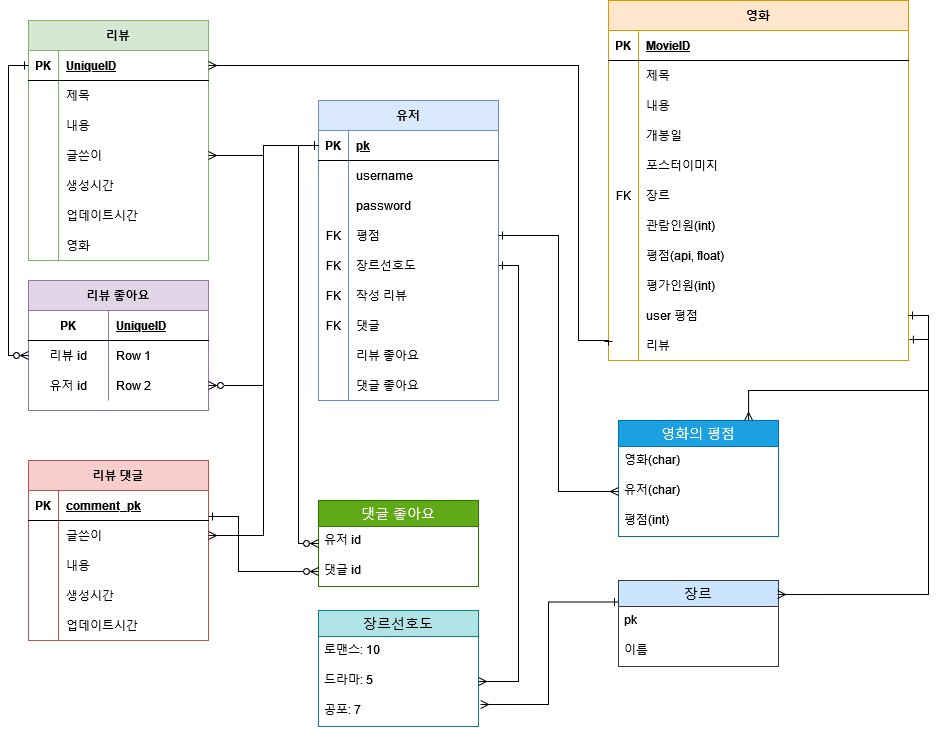

 

---

## :+1: 구현한 기능

#### 관리자 뷰

- 관리자 권한의 유저가 영화 등록 / 수정 / 삭제 할 수 있음
- 관리자 권한의 유저만 유저 관리 권한을 가짐
- 장고에서 기본적으로 제공하는 admin 기능을 이용하여 구현

#### 회원가입 및 로그인

- Django의 DRF와 All auth을 이용하여 Vue.js에서 회원가입 및 로그인 폼을 만들어 기능 구현

#### 영화정보

- TMDB사이트의 오픈API를 활용하여 데이터베이스 구축
- 로그인 된 유저들은 각 영화에 대해 평점 등록, 삭제, 수정이 가능 함.
- 영화 제목을 키워드로 검색하여 상세 페이지를 보여줌
- infinite scroll을 통해 한 페이지 내에서 DB에 저장된 모든 영화를 볼 수 있도록 함.
- 영화 상세 페이지에서 해당 영화 review 작성으로 넘어 갈 수 있도록 함.
- 해당 영화에 대한 리뷰 중 좋아요 수가 많은 3가지 리뷰만 볼 수 있도록 함.

#### 영화 추천 알고리즘

- 회원가입 시 8번의 선택을 통해 유저의 선호 장르 data를 얻고, 선호하는 상위 4가지 장르를 선별하여 랜덤하게 추천
- 1~3순위에 가중치를 두어 Top 3의 장르가 선택될 확률을 높여줌.
- 영화 평점 기록 시 data가 업데이트 되어, 새로운 영화 추천

#### 커뮤니티

- 영화 정보와 관련된 대화를 나눌 수 있는 커뮤니티 기능 구현
- 로그인한 사용자만 글을 작성할 수 있으며 작성자 본인만 글을 수정 / 삭제 하도록 만듦
- 각 게시글에는 댓글을 작성할 수 있고 게시글에 대한 좋아요 및 댓글에 대한 좋아요 기능 구현

- Pagination 구현
- 유저, 제목, 영화 제목을 클릭하면 각각, 유저 프로필, 리뷰 상세, 영화 상세로 이동 함.

## :movie_camera: 애플리케이션 이미지

- 메인화면(비로그인)

  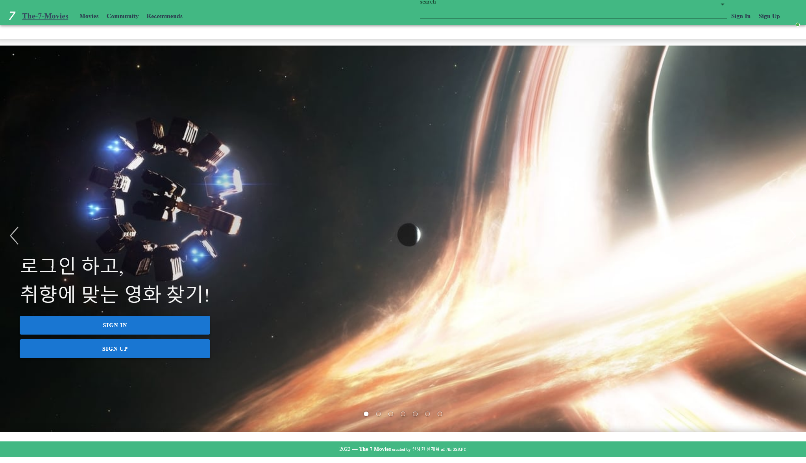

 

- 회원가입

  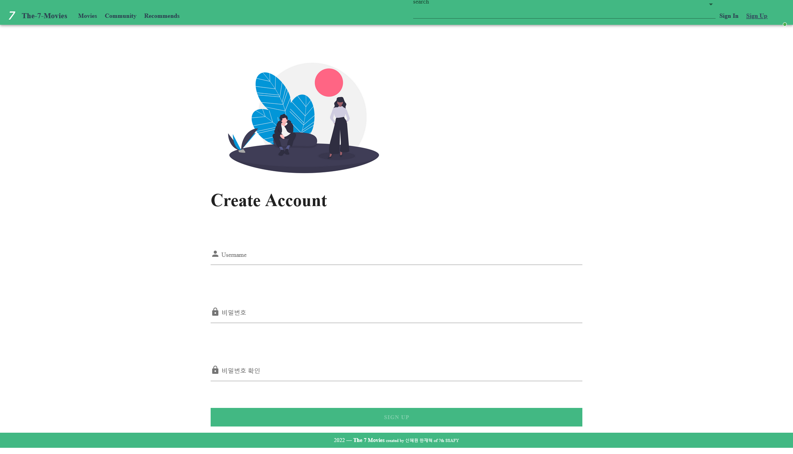

- 회원가입 후 초기 장르 데이터를 쌓기 위한 선호 영화 선택 페이지

  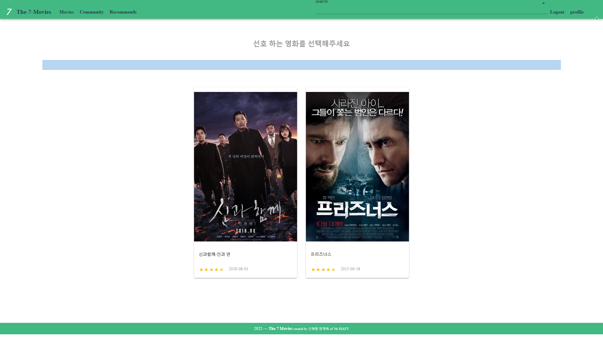

 

- 로그인

  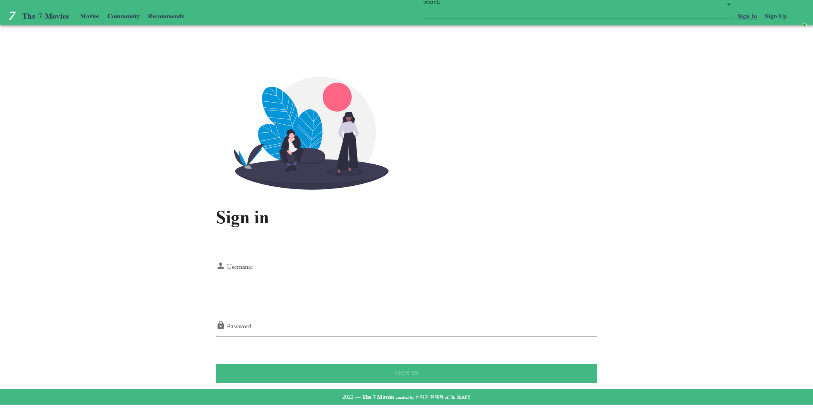

 

- 로그아웃

  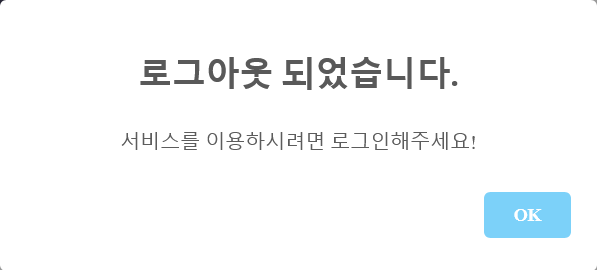

  

 

- 로그인 후 메인화면

  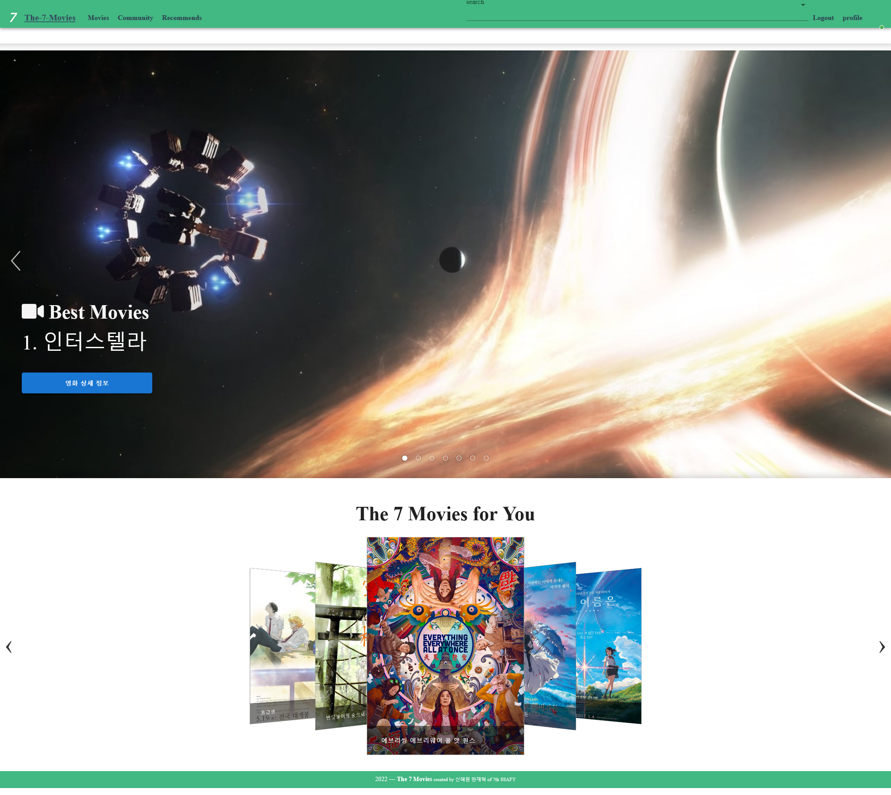

  

 

- Movies

  

  *infinite scroll 사용으로 일부 영화 사진이 보이지 않게 나왔습니다

 

- 영화 상세

  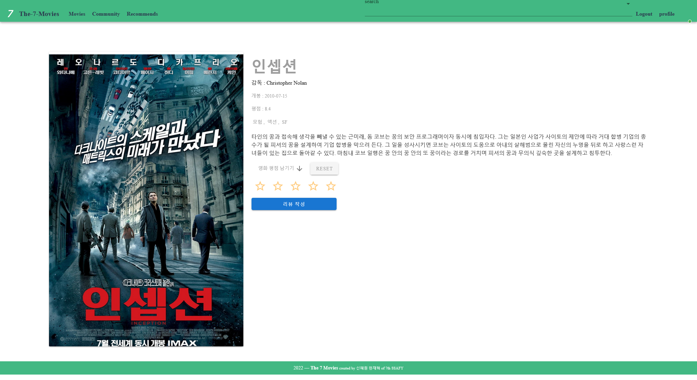

  

 

- 리뷰작성

  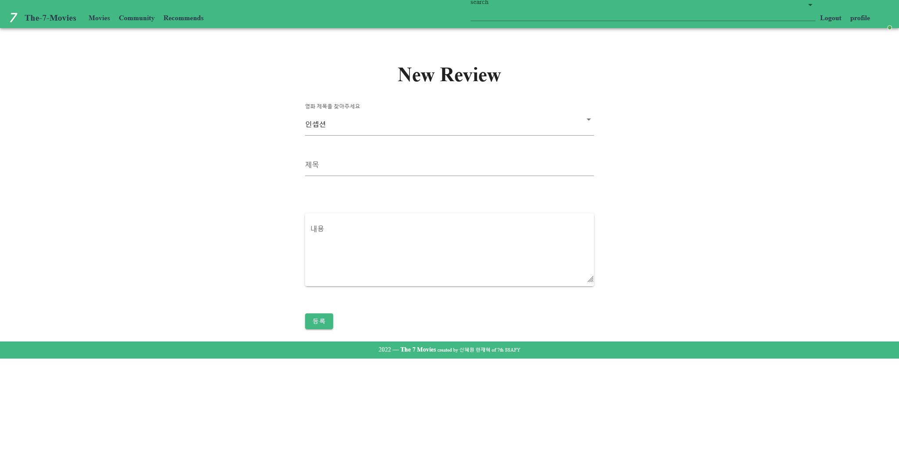

 

- 리뷰List

  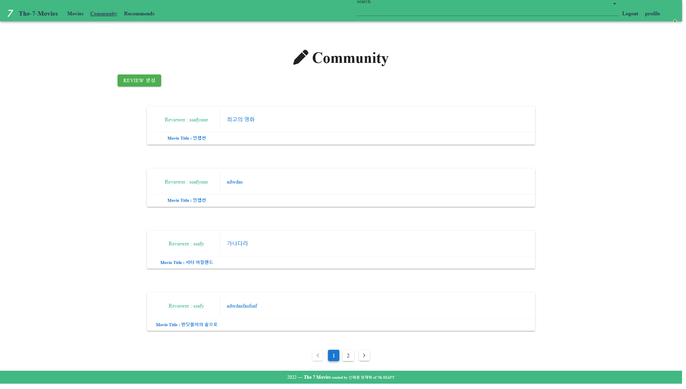

 

- Review Detail

  

 

- Recommend

  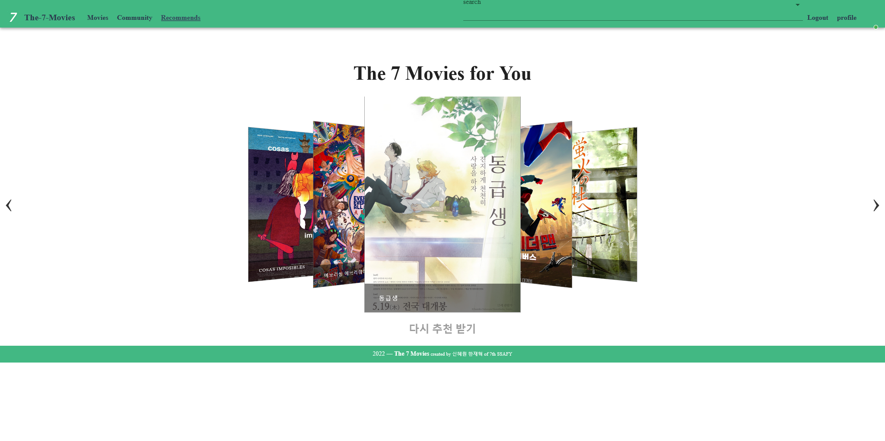

## :blush: 느낀점

-  한재혁
   -  이전까지 했던 프로젝트들도 쉬운 것은 아니었지만, 대부분 하루 내에 끝낼 수 있던 것이었지만, 프로젝트를 일주일 동안 하니, 그만큼 해야하는 것도 많아지고, 계속 진행하는 과정에서 이전에 했던 것들이 문제가 되고 다시 이를 고치는 과정을 계속해서 하다보니, 육체적으로나 정신적으로나 많이 피로를 느꼈습니다. 그래도 이번 프로젝트를 경험함으로써, 프로젝트를 진행하는 과정에서 기초 설계를 잘해야한다는 것이나, 안배를 잘 해 피로를 덜 쌓을 수 있는 방법을 찾게되는 등 좋은 경험이 되었습니다. 이를 통해 2학기에는 좀 더 나은 프로젝트 수행능력을 가질 수 있기를 기대합니다
   
- 신혜원

  -  발표 자료 까지 작성을 하고 나니, 27일 새벽 1시가 되었다. 일주일간 매일 12시가 넘도록 했었는데, 결과를 보니 아쉽다는 생각이 많이 든다. 부족한 부분이 너무 많았던 것 같고, 방학 때 열심히 해서 2학기 때는 더 완성도 있는 결과를 내고 싶다.

     다만, 12시까지 하면서 내 실력보다 체력이 더 중요한 것 같다고 생각이 들었고, 운동도 열심히 해야할 것 같다. 
     그래도 아무것도 모른채로 SSAFY에 들어와서, 명세서에 따라 결과물을 도출 해내었다는 것은 좋다. 
     설계를 지속해서 변경을 했고 결과에 대한 욕심으로 이것저것 계속 요청을 했는데 잘 해결해준 페어에게 고맙다.